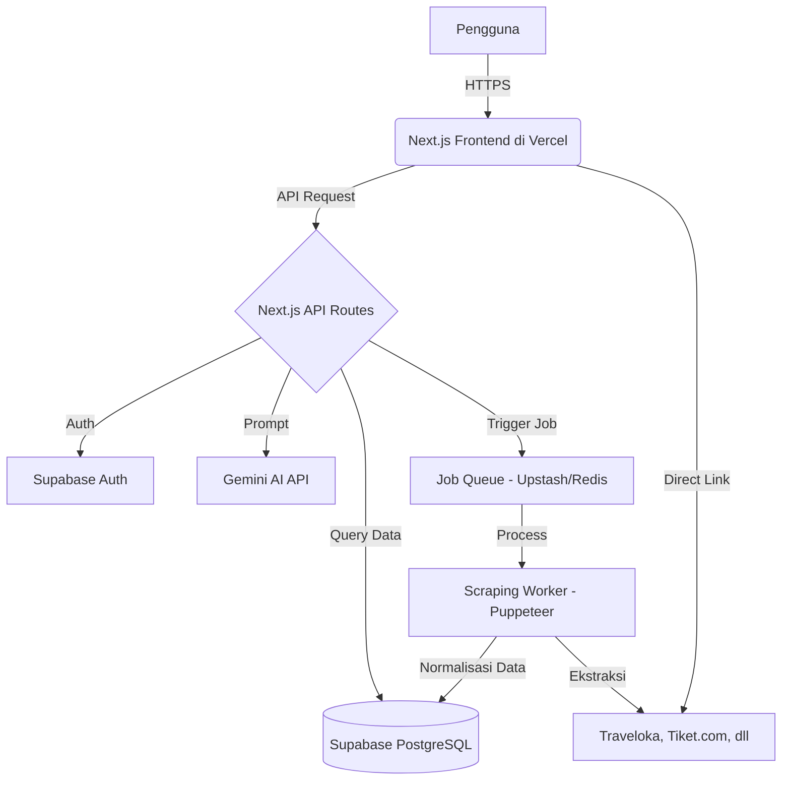

Berikut adalah versi **Blueprint.md** dan **MVP.md** yang jauh lebih detail, komprehensif, dan profesional. Dokumen ini dirancang untuk menjadi panduan teknis yang siap dieksekusi oleh developer (atau Anda sendiri) dari hari pertama hingga rilis.

---

# 📐 Blueprint.md — Cetak Biru Arsitektur & Sistem (Detail)

> **Dokumen ini mendefinisikan arsitektur teknis, alur data, standar UI/UX, dan keamanan untuk website Pesona Jogja.**

## 1. Arsitektur Sistem & Alur Data (Deep Dive)



### Penjelasan Alur:
1. **Frontend (Next.js):** Menerima input pengguna (lokasi, tanggal, filter). Menggunakan SSR (Server-Side Rendering) untuk SEO dan kecepatan muat awal.
2. **API Layer:** Memvalidasi input menggunakan **Zod**. Jika data sudah ada di cache/database, langsung dikembalikan. Jika tidak, memicu *scraping job*.
3. **Scraping Engine:** Berjalan sebagai *background worker* (menggunakan Puppeteer/Playwright). Menggunakan *Job Queue* (Upstash Redis) untuk mengantre permintaan agar tidak memblokir server utama.
4. **Database (Supabase):** Menyimpan data hasil normalisasi. Karena batas 2GB, diterapkan *Data Retention Policy* (hapus data scraping yang usang > 30 hari).
5. **AI Assistant:** Menggunakan Gemini API dengan *context injection* dari data Supabase untuk memberikan rekomendasi personal.

---

## 2. Stack Teknologi & Library (Detail)

| Kategori | Teknologi | Fungsi Spesifik |
|----------|-----------|-----------------|
| **Framework** | Next.js 14+ (App Router) | Routing, SSR, API Routes |
| **Bahasa** | TypeScript (`.tsx`) | Type safety, maintainability |
| **Styling** | Tailwind CSS | Utility-first CSS, kustomisasi tema |
| **Animasi** | Framer Motion | Transisi halus, efek *glassmorphism* |
| **Ikon** | Lucide React | Ikon modern dan konsisten |
| **Validasi** | Zod | Validasi input form & API |
| **Database** | Supabase (PostgreSQL) | Auth, Realtime, Row Level Security |
| **AI** | Gemini API (`@google/generative-ai`) | Chatbot & rekomendasi cerdas |
| **Scraping** | Puppeteer / Playwright | Crawling halaman dinamis |
| **Parsing** | Cheerio | Ekstraksi HTML statis |
| **Queue** | Upstash Redis | Manajemen antrean scraping |
| **Deployment** | Vercel | CI/CD, Edge Functions, Cron Jobs |

---

## 3. Skema Database (Supabase) — Lengkap dengan Relasi & Index

### Tabel `users` (Supabase Auth)
| Kolom | Tipe | Constraint | Keterangan |
|-------|------|------------|------------|
| `id` | UUID | PK | Primary Key |
| `email` | VARCHAR | Unique | |
| `full_name` | VARCHAR | | |
| `avatar_url` | TEXT | | |
| `created_at` | TIMESTAMP | Default: now() | |

### Tabel `locations`
| Kolom | Tipe | Constraint | Keterangan |
|-------|------|------------|------------|
| `id` | SERIAL | PK | Primary Key |
| `kabupaten` | VARCHAR | Index | Nama kabupaten/kota |
| `kecamatan` | VARCHAR | Index | Nama kecamatan |
| `desa` | VARCHAR | | Nama desa/kelurahan |
| `latitude` | DECIMAL(10,8) | | Koordinat |
| `longitude` | DECIMAL(11,8) | | Koordinat |

### Tabel `destinations`
| Kolom | Tipe | Constraint | Keterangan |
|-------|------|------------|------------|
| `id` | SERIAL | PK | Primary Key |
| `name` | VARCHAR | Index | Nama destinasi |
| `location_id` | INT | FK -> locations.id | Relasi lokasi |
| `description` | TEXT | | Deskripsi |
| `image_url` | TEXT | | Gambar utama |
| `rating` | DECIMAL(3,2) | | Rating 0-5 |
| `source_platform` | VARCHAR | Index | Traveloka, Tiket.com |
| `source_url` | TEXT | | Link asli |
| `scraped_at` | TIMESTAMP | | Waktu scraping |

### Tabel `accommodations`
| Kolom | Tipe | Constraint | Keterangan |
|-------|------|------------|------------|
| `id` | SERIAL | PK | Primary Key |
| `name` | VARCHAR | Index | Nama hotel/penginapan |
| `location_id` | INT | FK -> locations.id | Relasi lokasi |
| `star_rating` | INT | Check: 1-5 | Bintang hotel |
| `price_per_night` | DECIMAL(12,2) | | Harga per malam |
| `source_platform` | VARCHAR | | |
| `source_url` | TEXT | | |
| `scraped_at` | TIMESTAMP | | |

### Tabel `transportations`
| Kolom | Tipe | Constraint | Keterangan |
|-------|------|------------|------------|
| `id` | SERIAL | PK | Primary Key |
| `type` | VARCHAR | Index | Pesawat, Kereta, Kapal |
| `provider` | VARCHAR | | Maskapai / Operator |
| `departure` | VARCHAR | | Kota asal |
| `arrival` | VARCHAR | | Kota tujuan (Yogyakarta) |
| `price` | DECIMAL(12,2) | | Harga tiket |
| `source_platform` | VARCHAR | | |
| `source_url` | TEXT | | |

### Tabel `search_history`
| Kolom | Tipe | Constraint | Keterangan |
|-------|------|------------|------------|
| `id` | SERIAL | PK | Primary Key |
| `user_id` | UUID | FK -> users.id, Nullable | Guest bisa null |
| `location_query` | VARCHAR | | |
| `check_in` | DATE | | |
| `check_out` | DATE | | |
| `created_at` | TIMESTAMP | Default: now() | |

### Tabel `scraping_logs`
| Kolom | Tipe | Constraint | Keterangan |
|-------|------|------------|------------|
| `id` | SERIAL | PK | Primary Key |
| `target_url` | TEXT | | URL yang di-scrape |
| `status` | VARCHAR | | Success, Failed, Pending |
| `items_scraped` | INT | | Jumlah item |
| `error_message` | TEXT | | Jika gagal |
| `duration_ms` | INT | | Durasi scraping |
| `created_at` | TIMESTAMP | Default: now() | |

---

## 4. Mekanisme Scraping & Crawling (Detail Teknis)

### Lifecycle Scraping Job:
1. **Trigger:** Pengguna mencari "Hotel di Sleman, 2 Okt - 3 Okt".
2. **Cache Check:** Cek apakah data untuk parameter tersebut sudah ada di Supabase (berdasarkan `location_id` dan tanggal). Jika ada dan umur < 24 jam, langsung tampilkan.
3. **Queue:** Jika tidak ada, masukkan job ke Upstash Redis.
4. **Worker:** Worker (Puppeteer) mengambil job, membuka halaman Traveloka/Tiket.com.
5. **Ekstraksi:** Menggunakan selector CSS/XPath untuk mengambil data (nama, harga, rating, URL).
6. **Normalisasi:** Data dari berbagai OTA disatukan ke skema database yang konsisten.
7. **Simpan:** Insert ke Supabase. Update `scraping_logs`.
8. **Notifikasi:** Frontend melakukan polling atau menggunakan Supabase Realtime untuk menampilkan hasil.

### Anti-Bot & Compliance:
- **Delay:** Jeda 2-5 detik antar request.
- **User-Agent Rotation:** Menggunakan library `user-agents`.
- **Headless Detection Evasion:** Menggunakan `puppeteer-extra-plugin-stealth`.
- **Proxy:** Jika diperlukan, gunakan layanan proxy residensial.
- **Compliance:** Mematuhi `robots.txt` dan hanya mengambil data publik. Tidak menyimpan data sensitif.

---

## 5. Integrasi AI Assistant (Gemini API)

### Prompt Engineering:
```text
System Instruction:
Anda adalah "Pesona Jogja Assistant", pemandu wisata virtual yang ahli tentang Yogyakarta.
Gaya bahasa: Ramah, profesional, informatif, dan persuasif.
Tugas: Membantu pengguna merencanakan liburan ke Yogyakarta.

Context:
- Lokasi: {location}
- Tanggal: {check_in} s/d {check_out}
- Budget: {budget}
- Preferensi: {preferences}

Data Tersedia:
{destinations_data}
{accommodations_data}
{transportations_data}

Aturan:
1. Jawab hanya berdasarkan data yang tersedia.
2. Jika data tidak tersedia, tawarkan untuk mencari alternatif.
3. Sertakan tautan (source_url) jika merekomendasikan sesuatu.
4. Jangan memberikan informasi yang tidak akurat.
```

### Fitur AI:
- **Rekomendasi Destinasi:** "Saya ingin wisata alam yang sepi, ada rekomendasi?"
- **Perbandingan Harga:** "Mana yang lebih murah, Hotel A atau Hotel B?"
- **Itinerary:** "Buatkan jadwal 3 hari 2 malam di Yogyakarta."
- **Fallback:** Jika API gagal, tampilkan pesan error dan saran pencarian manual.

---

## 6. UI/UX Design System (Glassmorphism)

### Palet Warna:
| Elemen | Nilai HEX | Tailwind Class |
|--------|-----------|----------------|
| **Background Gradient** | `#F0F9FF` → `#E0F2FE` → `#FFFFFF` | `bg-gradient-to-br from-sky-50 via-cyan-50 to-white` |
| **Primary** | `#0077B6` | `bg-[#0077B6]` |
| **Secondary** | `#00B4D8` | `bg-[#00B4D8]` |
| **Accent** | `#FFB703` | `bg-[#FFB703]` |
| **Text Primary** | `#1E293B` | `text-slate-800` |
| **Text Secondary** | `#64748B` | `text-slate-500` |
| **Glass Card** | `rgba(255,255,255,0.3)` | `bg-white/30 backdrop-blur-lg border border-white/40` |

### Komponen Utama:
1. **`<GlassCard />`**
   ```tsx
   <div className="bg-white/30 backdrop-blur-lg border border-white/40 shadow-lg rounded-2xl p-6">
     {children}
   </div>
   ```
2. **`<GlassButton />`**
   ```tsx
   <button className="bg-[#0077B6]/80 backdrop-blur-md text-white px-6 py-3 rounded-xl hover:bg-[#0077B6] transition-all">
     {children}
   </button>
   ```
3. **`<SearchBar />`** — Input lokasi, tanggal check-in/out, jumlah tamu.
4. **`<ResultCard />`** — Menampilkan gambar, nama, harga, rating, dan tombol "Lihat di Traveloka".
5. **`<ChatWidget />`** — Tombol melayang di kanan bawah, membuka panel chat AI.

### Tipografi:
- **Font:** Plus Jakarta Sans (Google Fonts).
- **Heading 1:** `text-4xl font-bold tracking-tight`
- **Heading 2:** `text-3xl font-semibold`
- **Body:** `text-base font-normal leading-relaxed`
- **Button:** `text-sm font-semibold uppercase tracking-wider`

---

## 7. Routing & API Endpoints (Detail)

### Halaman (Next.js App Router):
| Route | Deskripsi | Auth Required |
|-------|-----------|---------------|
| `/` | Beranda + Search Bar | No |
| `/search` | Hasil pencarian | No |
| `/dashboard` | Dashboard pengguna | Yes |
| `/login` | Login | No |
| `/register` | Registrasi | No |
| `/destination/[id]` | Detail destinasi | No |

### API Routes:
| Endpoint | Metode | Payload | Response |
|----------|--------|---------|----------|
| `/api/auth/register` | POST | `{ email, password, full_name }` | `{ user, session }` |
| `/api/auth/login` | POST | `{ email, password }` | `{ user, session }` |
| `/api/search` | POST | `{ location, check_in, check_out, type }` | `{ destinations, accommodations, transportations }` |
| `/api/scrape` | POST | `{ target, params }` | `{ job_id }` |
| `/api/ai/chat` | POST | `{ message, context }` | `{ reply }` |
| `/api/destinations` | GET | `?location_id=1` | `{ data }` |
| `/api/accommodations` | GET | `?location_id=1&star=4` | `{ data }` |
| `/api/transportations` | GET | `?type=pesawat` | `{ data }` |

---

## 8. Keamanan & Privasi (Detail)

- **Autentikasi:** Supabase Auth dengan JWT. Refresh token otomatis.
- **Row Level Security (RLS):**
  - `users`: Hanya bisa membaca/mengubah data sendiri.
  - `search_history`: Hanya bisa membaca/menghapus riwayat sendiri.
  - `destinations`, `accommodations`, `transportations`: Public read-only.
- **Rate Limiting:** Gunakan `@upstash/ratelimit` pada API Routes (misal: 10 request/menit per IP).
- **Validasi Input:** Zod schema untuk semua input form dan API.
- **Environment Variables:** Simpan di `.env.local` dan Vercel Dashboard. Jangan pernah commit ke GitHub.
- **CORS:** Batasi hanya untuk domain `pesonajogja.web.id`.
- **CSP (Content Security Policy):** Terapkan header CSP untuk mencegah XSS.

---

> **Blueprint ini bersifat hidup** — akan diperbarui seiring pengembangan proyek.

---

# 🚀 MVP.md — Minimum Viable Product (Detail)

> **Dokumen ini mendefinisikan ruang lingkup, fitur inti, target, dan rencana eksekusi untuk versi pertama Pesona Jogja.**

## 1. Tujuan MVP

Menyediakan platform *one-stop* untuk merencanakan liburan ke Yogyakarta yang:
- **Cepat:** Hasil pencarian muncul < 5 detik (dengan caching).
- **Akurat:** Data diambil langsung dari OTA terpercaya (Traveloka, Tiket.com).
- **Cerdas:** Didampingi AI Assistant yang memahami konteks Yogyakarta.
- **Indah:** Tampilan *glassmorphism* yang modern, minimalis, dan premium.

**Target Rilis MVP:** 8 minggu (2 bulan) dari mulai pengembangan.

---

## 2. Ruang Lingkup (Scope) — Detail Fitur

### ✅ In-Scope (Fitur MVP):
| No | Fitur | Detail Spesifikasi | Prioritas |
|----|-------|-------------------|-----------|
| 1 | **Setup Proyek** | Next.js 14+, Tailwind, Supabase, TypeScript, Font Plus Jakarta Sans | P0 |
| 2 | **Desain UI/UX** | Tema *glassmorphism*, gradient background, responsif (mobile-first) | P0 |
| 3 | **Halaman Beranda** | Hero section, Search Bar, Kupon Pengguna Baru, Footer | P0 |
| 4 | **Pencarian** | Input lokasi (Kabupaten/Kecamatan), tanggal check-in/out, jumlah tamu | P0 |
| 5 | **Scraping** | Traveloka & Tiket.com. Data: destinasi, penginapan, transportasi | P0 |
| 6 | **Hasil Pencarian** | Grid card dengan filter (harga, bintang, jenis transportasi) | P0 |
| 7 | **Direct Link** | Tombol "Pesan di Traveloka" / "Lihat di Tiket.com" | P0 |
| 8 | **Autentikasi** | Guest mode + Login/Register (Supabase Auth) | P1 |
| 9 | **AI Assistant** | Chatbot dasar dengan Gemini API. Bisa menjawab pertanyaan umum | P1 |
| 10 | **Deployment** | Vercel + Custom Domain `pesonajogja.web.id` | P0 |

### ❌ Out-of-Scope (Fase Berikutnya):
- Scraping dari Agoda, Airbnb, Booking.com.
- Fitur pembayaran langsung di website.
- Notifikasi email/push.
- Aplikasi mobile (Android/iOS).
- Fitur sosial (review, rating dari pengguna).
- Multi-bahasa (hanya Bahasa Indonesia).
- Fitur *wishlist* atau *save to favorite*.

---

## 3. User Stories & Acceptance Criteria (Detail)

### US-01: Pencarian Destinasi
**Sebagai** pengunjung, **saya ingin** mencari destinasi wisata di Yogyakarta berdasarkan kecamatan dan tanggal, **sehingga** saya bisa merencanakan liburan.

**Acceptance Criteria:**
- [ ] Input lokasi berupa dropdown/autocomplete (Kabupaten -> Kecamatan).
- [ ] Input tanggal menggunakan date picker (check-in & check-out).
- [ ] Validasi: Check-out harus setelah check-in.
- [ ] Tombol "Cari" memicu API `/api/search`.
- [ ] Loading state menampilkan skeleton loader.
- [ ] Hasil muncul dalam < 5 detik (jika cached) atau < 30 detik (jika scraping).

### US-02: Filter Penginapan
**Sebagai** pengunjung, **saya ingin** melihat pilihan penginapan dengan filter bintang 1-5, **sehingga** saya bisa memilih sesuai budget.

**Acceptance Criteria:**
- [ ] Filter bintang berupa checkbox atau slider.
- [ ] Filter harga (min-max) berupa range slider.
- [ ] Sorting: Harga terendah, rating tertinggi, popularitas.
- [ ] Setiap card menampilkan: gambar, nama, bintang, harga, rating, tombol direct link.

### US-03: AI Assistant
**Sebagai** pengunjung, **saya ingin** bertanya kepada AI Assistant tentang rekomendasi liburan di Yogyakarta, **sehingga** saya mendapat saran yang relevan.

**Acceptance Criteria:**
- [ ] Tombol chat melayang di kanan bawah.
- [ ] Panel chat muncul dengan animasi halus.
- [ ] AI merespons dalam < 3 detik.
- [ ] AI menyertakan tautan jika merekomendasikan sesuatu.
- [ ] Riwayat chat tersimpan selama sesi berlangsung.

### US-04: Direct Link
**Sebagai** pengunjung, **saya ingin** mengeklik tombol yang mengarah ke Traveloka/Tiket.com, **sehingga** saya bisa langsung memesan tiket.

**Acceptance Criteria:**
- [ ] Tombol "Pesan di Traveloka" membuka tab baru.
- [ ] URL mengarah ke halaman produk spesifik di OTA asli.
- [ ] Tombol memiliki atribut `rel="noopener noreferrer"`.

---

## 4. Rencana Sprint (8 Minggu)

| Sprint | Minggu | Fokus | Deliverable | Tools |
|--------|--------|-------|-------------|-------|
| **Sprint 1** | 1 | Setup & Fondasi | Repo GitHub, Next.js, Tailwind, Supabase, Font | VS Code, Git |
| **Sprint 2** | 2 | UI/UX Design | Desain Figma, Komponen `GlassCard`, `GlassButton`, Beranda | Figma, Tailwind |
| **Sprint 3** | 3-4 | Scraping Engine | Worker Puppeteer, Parser Traveloka & Tiket.com, Simpan ke Supabase | Puppeteer, Cheerio |
| **Sprint 4** | 5 | Integrasi Frontend | Halaman Pencarian, Hasil Pencarian, Filter, Direct Link | Next.js, Zod |
| **Sprint 5** | 6 | Auth & AI | Supabase Auth, Login/Register, Chatbot Gemini | Supabase, Gemini API |
| **Sprint 6** | 7 | Testing & Optimasi | Unit test, Integration test, Lighthouse score > 90 | Jest, Playwright |
| **Sprint 7** | 8 | Deployment | Deploy ke Vercel, Custom Domain, Monitoring | Vercel, UptimeRobot |

---

## 5. Metrik Keberhasilan (KPI) — Detail

| Metrik | Target | Cara Mengukur |
|--------|--------|---------------|
| **Lighthouse Performance** | > 90 | Chrome DevTools |
| **Waktu Muat Halaman** | < 3 detik | Vercel Analytics |
| **Tingkat Keberhasilan Scraping** | > 80% | Log Supabase |
| **Jumlah OTA** | 2 platform | Traveloka, Tiket.com |
| **Durasi Sesi Pengguna** | > 2 menit | Google Analytics |
| **Klik Direct Link** | > 50% | Event Tracking |
| **Uptime Website** | > 99% | UptimeRobot |
| **API Response Time** | < 500ms | Vercel Logs |

---

## 6. Risiko & Mitigasi (Detail)

| Risiko | Dampak | Probabilitas | Mitigasi |
|--------|--------|--------------|----------|
| OTA memblokir scraper | Tinggi | Sedang | Delay, rotasi user-agent, proxy, fallback ke API resmi |
| Kuota Supabase 2GB penuh | Sedang | Rendah | Kompresi data, hapus log > 30 hari, caching agresif |
| Rate limit Gemini API | Sedang | Sedang | Caching respons, fallback ke pencarian manual |
| Performa lambat | Sedang | Sedang | Optimasi gambar (Next/Image), code splitting, ISR |
| Perubahan struktur HTML OTA | Tinggi | Tinggi | Parser modular, monitoring berkala, alert jika gagal |
| Kehilangan data | Tinggi | Rendah | Backup harian Supabase, export ke CSV |

---

## 7. Testing Strategy (Detail)

| Jenis Test | Tools | Cakupan |
|------------|-------|---------|
| **Unit Test** | Jest + React Testing Library | Komponen UI, utilitas, validasi Zod |
| **Integration Test** | Jest + Supabase Client | API Routes, query database |
| **E2E Test** | Playwright | Alur pengguna: cari -> lihat hasil -> klik direct link |
| **Performance Test** | Lighthouse, WebPageTest | Kecepatan muat, skor aksesibilitas |
| **Security Test** | OWASP ZAP | XSS, SQL Injection, CSRF |

---

## 8. Definisi Selesai (Definition of Done)

Sebuah fitur dianggap selesai jika:
- ✅ Kode sudah di-*push* ke repository GitHub.
- ✅ Tidak ada *error* di console browser maupun server.
- ✅ Sudah diuji di *desktop* (Chrome, Firefox) dan *mobile* (Android, iOS).
- ✅ Responsif dan sesuai dengan tema *glassmorphism*.
- ✅ Dokumentasi (jika perlu) sudah diperbarui.
- ✅ Sudah di-*deploy* ke Vercel dan dapat diakses publik.
- ✅ Lighthouse score > 90 untuk Performance, Accessibility, Best Practices, SEO.

---

## 9. Langkah Selanjutnya Setelah MVP (Roadmap)

| Fase | Fitur | Target |
|------|-------|--------|
| **Fase 2** | Scraping Agoda, Airbnb, Booking.com | Bulan 3 |
| **Fase 3** | Fitur Review & Rating dari pengguna | Bulan 4 |
| **Fase 4** | Notifikasi harga tiket/penginapan | Bulan 5 |
| **Fase 5** | Integrasi pembayaran (Midtrans/Xendit) | Bulan 6 |
| **Fase 6** | Aplikasi mobile (React Native) | Bulan 7-8 |
| **Fase 7** | Multi-bahasa (Inggris, Jawa) | Bulan 9 |

---

> **MVP ini adalah fond asi.** Fokus pada kualitas, kecepatan, dan pengalaman pengguna yang premium. 🏝️✨

---

Dengan dokumen **Blueprint.md** dan **MVP.md** yang detail ini, pengembangan proyek **Pesona Jogja** dapat dimulai secara terstruktur, terukur, dan sesuai dengan visi awal. Selamat mengembangkan! 🚀